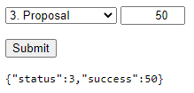

# How to preview this project

## On the web:

[Here](https://jsfiddle.net/alexravs/rzfde8vn/37/) is a link to the jsfiddle holding and running the code.

## Locally:

Because of CORS, we cannot just open the index.html file in a browser and expect it to work (see [this](https://stackoverflow.com/a/50197517) short explanation). To be able to run it, you can for example install the VS Code extension called ["Live server"](https://marketplace.visualstudio.com/items?itemName=ritwickdey.LiveServer) and follow [those quick steps](https://marketplace.visualstudio.com/items?itemName=ritwickdey.LiveServer#shortcuts-to-startstop-server). This will spin up a local server that will serve the html and its js modules accordingly.

# Instructions

## Page dynamics:

- Load the `<select>` options with the contents of the global oppoStatus array.
- When status is changed, set the associated value of success (e.g. status 4 sets success=75)
- On form submit, output the form element values as JSON string. We want to see the values, not the text. {"status":3,"success":50}

## Basic styling:

- Right align the success value
- Display the Submit button in it's own box. Add some spacing around the element.
- Set a mono-space font on the output 
 so we have a better view on the generated JSON output.

How it should look (more or less) with styles applied and when the form is submitted:

# Rules
- This is a personal test, don't share this page with friends or online
- You cannot modify the HTML source
- Use CSS, SCSS or Sass for styling, no JS
- Use only pure JS, external frameworks or libraries (e.g. jQuery) are not allowed.
- You don't have to support retired browsers, ECMA 2019 is allowed!